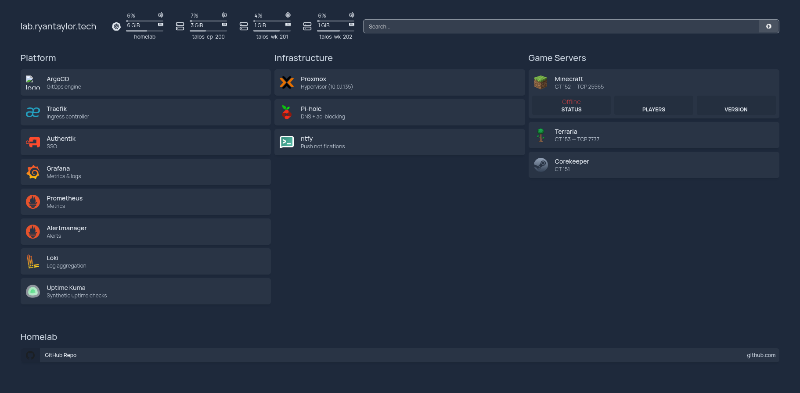

# homelab

Single-node Proxmox host running a three-VM Talos Kubernetes cluster, managed entirely via GitOps (ArgoCD + SOPS).

## Stack

| Layer | Tech |
|---|---|
| Hypervisor | Proxmox VE 9.x |
| Kubernetes | Talos v1.13 / k8s v1.36 |
| GitOps | ArgoCD (app-of-apps, sync waves) |
| Ingress | Traefik + MetalLB (VIP `10.0.1.210`) |
| TLS | cert-manager + Let's Encrypt (Cloudflare DNS-01) |
| SSO | Authentik (forward-auth for all services) |
| Secrets | SOPS + age + KSOPS |
| Monitoring | kube-prometheus-stack · Loki · Promtail · ntfy |
| DNS | Pi-hole (`*.lab.ryantaylor.tech` wildcard → Traefik) |
| Remote access | Tailscale subnet router (LXC) |

## Nodes

| Type | Count | Spec |
|---|---|---|
| Proxmox host | 1 | i7-4790, 24 GB RAM |
| Control plane VM | 1 | 2 vCPU, 4 GB |
| Worker VMs | 2 | 4 vCPU, 6 GB each |
| LXC containers | 5 | DNS, VPN, game servers |

## Services

<!-- screenshot: Homepage dashboard (lab.ryantaylor.tech) -->


| Service | URL |
|---|---|
| Dashboard | `https://lab.ryantaylor.tech` |
| Homelab Dash | `https://dash.lab.ryantaylor.tech` |
| ArgoCD | `https://argocd.lab.ryantaylor.tech` |
| Authentik | `https://authentik.lab.ryantaylor.tech` |
| Grafana | `https://grafana.lab.ryantaylor.tech` |
| Prometheus | `https://prometheus.lab.ryantaylor.tech` |
| Alertmanager | `https://alertmanager.lab.ryantaylor.tech` |
| Uptime Kuma | `https://uptime.lab.ryantaylor.tech` |
| ntfy | `https://ntfy.lab.ryantaylor.tech` |
| Traefik | `https://traefik.lab.ryantaylor.tech` |

<!-- screenshot: Grafana node exporter dashboard showing all nodes + LXCs -->
<!--  -->

<!-- screenshot: Uptime Kuma status page -->
<!--  -->

## Repo Layout

```
kubernetes/
  bootstrap/     # ArgoCD install + KSOPS wiring
  apps/          # App-of-apps (one dir per service)
  talos/         # Talos machine configs (SOPS-encrypted)
terraform/       # Proxmox VM provisioning
ansible/         # LXC base config + Promtail
apps/
  dash/          # Custom Proxmox + k8s dashboard (Go + Svelte)
docs/            # inventory.md (detailed reference)
```

## Details

Full documentation lives in the [wiki](https://github.com/ryyyyan-taylor/homelab/wiki).
